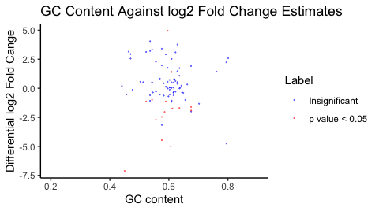

The *exomePeak2* user's guide
================
Zhen Wei <ZhenWei@xjtlu.edu.cn>
Jia Meng <JiaMeng@xjtlu.edu.cn>
Department of Biological Sciences, Xi’an Jiaotong-Liverpool University, Suzhou, Jiangsu, 215123, China &
Institute of Integrative Biology, University of Liverpool, L7 8TX, Liverpool, United Kingdom
2019-11-22

Package Installation
====================

To install exomePeak2 from Github, use the following codes.

``` r
if (!requireNamespace("BiocManager", quietly = TRUE))
    install.packages("BiocManager")

BiocManager::install(c("SummarizedExperiment","cqn","Rsamtools",
                       "GenomicAlignments","GenomicRanges","GenomicFeatures",
                       "DESeq2","ggplot2","mclust",
                       "genefilter","BSgenome","BiocParallel",
                       "IRanges","S4Vectors","quantreg",
                       "reshape2","rtracklayer","apeglm","RMariaDB"))

if (!requireNamespace("devtools", quietly = TRUE))
    install.packages("devtools")

devtools::install_github("ZhenWei10/exomePeak2")
```

Peak Calling
============

Users need to specify the bam file directories of IP and input samples separately using the arguments of `bam_ip` and `bam_input`; the biological replicates are represented by a character vector of the **BAM** file directories.

Transcript annotation is provided using GFF files in this example. The transcript annotation can also come from the `TxDb` object. exomePeak2 will automatically download the TxDb if you fill the `genome` argument with the UCSC genome name.

The genome sequence is required to conduct GC content bias correction. If the `genome` argument is missing ( `= NULL` ), exomPeak2 will perform peak calling without correcting the GC content bias.

``` r
library(exomePeak2)

GENE_ANNO_GTF = system.file("extdata", "example.gtf", package="exomePeak2")

f1 = system.file("extdata", "IP1.bam", package="exomePeak2")
f2 = system.file("extdata", "IP2.bam", package="exomePeak2")
f3 = system.file("extdata", "IP3.bam", package="exomePeak2")
f4 = system.file("extdata", "IP4.bam", package="exomePeak2")
IP_BAM = c(f1,f2,f3,f4)

f1 = system.file("extdata", "Input1.bam", package="exomePeak2")
f2 = system.file("extdata", "Input2.bam", package="exomePeak2")
f3 = system.file("extdata", "Input3.bam", package="exomePeak2")
INPUT_BAM = c(f1,f2,f3)

exomePeak2(bam_ip = IP_BAM,
           bam_input = INPUT_BAM,
           gff_dir = GENE_ANNO_GTF,
           genome = "hg19",
           paired_end = FALSE)
## class: SummarizedExomePeak 
## dim: 31 7 
## metadata(0):
## assays(2): counts GCsizeFactors
## rownames(31): mod_11 mod_13 ... control_13 control_14
## rowData names(2): GC_content feature_length
## colnames(7): IP1.bam IP2.bam ... Input2.bam Input3.bam
## colData names(3): design_IP design_Treatment sizeFactor
```

exomePeak2 will export the modification peaks in formats of **BED** file and **CSV** table, the data will be saved automatically under a folder named by `exomePeak2_output`.

Explaination over the columns of the exported table:

-   `chr`: the chromosomal name of the peak.

-   `chromStart`: the start of the peak on the chromosome.

-   `chromEnd`: the end of the peak on the chromosome.

-   `name`: the unique ID of the modification peak.

-   `score`: the -log2 p value of the peak.

-   `strand`: the strand of the peak on genome.

-   `thickStart`: the start position of the peak.

-   `thickEnd`: the end position of the peak.

-   `itemRgb`: the column for the RGB encoded color in BED file visualization.

-   `blockCount`: the block (exon) number within the peak.

-   `blockSizes`: the widths of blocks.

-   `blockStarts`: the start positions of blocks.

-   `geneID`: the gene ID of the peak.

-   `ReadsCount.input`: the reads count of the input sample.

-   `ReadsCount.IP`: the reads count of the IP sample.

-   `log2FoldChange`: the log2 IP over input fold enrichment.

-   `pvalue`: the p value of the enrichment.

-   `padj`: the adjusted p value using BH approach.

Differential Modification Analysis
==================================

The code below could conduct differential modification analysis (Comparison of Two Conditions) on exon regions defined by the transcript annotation.

In differential modification mode, exomePeak2 will first perform Peak calling on exon regions using both the control and treated samples. Then, it will conduct the differential modification analysis on peaks reported from peak calling using an interactive GLM.

``` r
f1 = system.file("extdata", "treated_IP1.bam", package="exomePeak2")
TREATED_IP_BAM = c(f1)
f1 = system.file("extdata", "treated_Input1.bam", package="exomePeak2")
TREATED_INPUT_BAM = c(f1)

exomePeak2(bam_ip = IP_BAM,
           bam_input = INPUT_BAM,
           bam_treated_input = TREATED_INPUT_BAM,
           bam_treated_ip = TREATED_IP_BAM,
           gff_dir = GENE_ANNO_GTF,
           genome = "hg19",
           paired_end = FALSE)
## class: SummarizedExomePeak 
## dim: 23 9 
## metadata(0):
## assays(2): counts GCsizeFactors
## rownames(23): mod_10 mod_11 ... control_5 control_6
## rowData names(2): GC_content feature_length
## colnames(9): IP1.bam IP2.bam ... treated_IP1.bam
##   treated_Input1.bam
## colData names(3): design_IP design_Treatment sizeFactor
```

In differential modification mode, exomePeak2 will export the differential modification peaks in formats of **BED** file and **CSV** table, the data will also be saved automatically under a folder named by `exomePeak2_output`.

Explaination for the additional table columns:

-   `ModLog2FC_control`: the modification log2 fold enrichment in the control condition.

-   `ModLog2FC_treated`: the modification log2 fold enrichment in the treatment condition.

-   `DiffModLog2FC`: the log2 Fold Change of differential modification.

-   `pvalue`: the p value of the differential modification.

-   `padj`: the adjusted p value using BH approach.

Quantification and Statistical Analysis with Single Based Modification Annotation
=================================================================================

exomePeak2 supports the modification quantification and differential modification analysis on single based modification annotation. The modification sites with single based resolution can provide a more accurate mapping of modification locations compared with the peaks called directly from the MeRIP-seq datasets.

Some of the datasets in epitranscriptomics have a single based resolution, e.x. Data generated by the m6A-CLIP-seq or m6A-miCLIP-seq techniques. exomePeak2 could provide a more accurate and consistent quantification and modification status inference for MeRIP-seq experiments using single based annotation.

exomePeak2 will automatically initiate the mode of single based modification quantification by providing a sigle based annotation file under the argument `mod_annot`.

The single based annotation information should be provided to the exomePeak2 function in the format of a `GRanges` object.

``` r
f2 = system.file("extdata", "mod_annot.rds", package="exomePeak2")

MOD_ANNO_GRANGE <- readRDS(f2)

exomePeak2(bam_ip = IP_BAM,
           bam_input = INPUT_BAM,
           gff_dir = GENE_ANNO_GTF,
           genome = "hg19",
           paired_end = FALSE,
           mod_annot = MOD_ANNO_GRANGE)
## class: SummarizedExomePeak 
## dim: 171 7 
## metadata(0):
## assays(2): '' GCsizeFactors
## rownames(171): mod_1 mod_2 ... control_83 control_84
## rowData names(2): GC_content feature_length
## colnames(7): IP1.bam IP2.bam ... Input2.bam Input3.bam
## colData names(3): design_IP design_Treatment sizeFactor
```

In this mode, exomePeak2 will export the analysis result also in formats of **BED** file and **CSV** table, while each row of the table corresponds to the sites of the annotation `GRanges`.

Peak Calling and Visualization in Multiple Steps
================================================

The exomePeak2 package can achieve peak calling and peak statistics calulation with multiple functions.

**1. Check the bam files of MeRIP-seq data before peak calling.**

``` r
MeRIP_Seq_Alignment <- scanMeripBAM(
                         bam_ip = IP_BAM,
                         bam_input = INPUT_BAM,
                         paired_end = FALSE
                        )
```

For MeRIP-seq experiment with interactive design (contain control and treatment groups), use the following code.

``` r
MeRIP_Seq_Alignment <- scanMeripBAM(
    bam_ip = IP_BAM,
    bam_input = INPUT_BAM,
    bam_treated_input = TREATED_INPUT_BAM,
    bam_treated_ip = TREATED_IP_BAM,
    paired_end = FALSE
  ) 
```

**2. Conduct peak calling analysis on exons using the provided bam files.**

``` r
SummarizedExomePeaks <- exomePeakCalling(merip_bams = MeRIP_Seq_Alignment,
                                         gff_dir = GENE_ANNO_GTF,
                                         genome = "hg19") 
```

Alternatively, use the following code to quantify MeRIP-seq data on single based modification annotation.

``` r
SummarizedExomePeaks <- exomePeakCalling(merip_bams = MeRIP_Seq_Alignment,
                                         gff_dir = GENE_ANNO_GTF,
                                         genome = "hg19",
                                         mod_annot = MOD_ANNO_GRANGE) 
```

**3. Estimate size factors that are required for GC content bias correction.**

``` r
SummarizedExomePeaks <- normalizeGC(SummarizedExomePeaks)
```

**4. Report the statistics of modification peaks using Generalized Linear Model (GLM).**

``` r
SummarizedExomePeaks <- glmM(SummarizedExomePeaks) 
```

Alternatively, If the treated IP and input bam files are provided, `glmDM` function could be used to conduct differential modification analysis on modification Peaks with interactive GLM.

``` r
SummarizedExomePeaks <- glmDM(SummarizedExomePeaks)
```

**5. Generate plots for the linear relationships between GC content and reads abundence.**

``` r
plotReadsGC(SummarizedExomePeaks)
```



**6. Generate the scatter plot between GC content and log2 Fold Change (LFC).**

``` r
plotLfcGC(SummarizedExomePeaks) 
```


**7. Generate the bar plot for the sequencing depth size factors.**

``` r
plotSizeFactors(SummarizedExomePeaks)
```


**8. Export the modification peaks and the peak statistics with user decided format.**

``` r
exportResults(SummarizedExomePeaks, format = "BED") 
```

Contact
=======

Please contact the maintainer of exomePeak2 if you have encountered any problems:

**ZhenWei**: <zhen.wei@xjtlu.edu.cn>

Please visit the github page of exomePeak2:

<https://github.com/ZhenWei10/exomePeak2>

Session Info
============

``` r
sessionInfo()
## R version 3.5.3 (2019-03-11)
## Platform: x86_64-apple-darwin15.6.0 (64-bit)
## Running under: macOS Sierra 10.12.6
## 
## Matrix products: default
## BLAS: /Library/Frameworks/R.framework/Versions/3.5/Resources/lib/libRblas.0.dylib
## LAPACK: /Library/Frameworks/R.framework/Versions/3.5/Resources/lib/libRlapack.dylib
## 
## locale:
## [1] zh_CN.UTF-8/zh_CN.UTF-8/zh_CN.UTF-8/C/zh_CN.UTF-8/zh_CN.UTF-8
## 
## attached base packages:
##  [1] splines   parallel  stats4    stats     graphics  grDevices utils    
##  [8] datasets  methods   base     
## 
## other attached packages:
##  [1] BSgenome.Hsapiens.UCSC.hg19_1.4.0 BSgenome_1.50.0                  
##  [3] rtracklayer_1.42.2                Biostrings_2.50.2                
##  [5] XVector_0.22.0                    exomePeak2_1.0.0                 
##  [7] cqn_1.28.1                        quantreg_5.51                    
##  [9] SparseM_1.77                      preprocessCore_1.44.0            
## [11] nor1mix_1.3-0                     mclust_5.4.5                     
## [13] SummarizedExperiment_1.12.0       DelayedArray_0.8.0               
## [15] BiocParallel_1.16.6               matrixStats_0.54.0               
## [17] Biobase_2.42.0                    GenomicRanges_1.34.0             
## [19] GenomeInfoDb_1.18.2               IRanges_2.16.0                   
## [21] S4Vectors_0.20.1                  BiocGenerics_0.28.0              
## [23] BiocStyle_2.10.0                 
## 
## loaded via a namespace (and not attached):
##  [1] bitops_1.0-6             bit64_0.9-7             
##  [3] httr_1.4.0               progress_1.2.2          
##  [5] RColorBrewer_1.1-2       numDeriv_2016.8-1.1     
##  [7] tools_3.5.3              backports_1.1.5         
##  [9] R6_2.4.0                 rpart_4.1-15            
## [11] Hmisc_4.2-0              DBI_1.0.0               
## [13] lazyeval_0.2.2           colorspace_1.4-1        
## [15] apeglm_1.4.2             nnet_7.3-12             
## [17] prettyunits_1.0.2        tidyselect_0.2.5        
## [19] gridExtra_2.3            DESeq2_1.22.2           
## [21] bit_1.1-14               compiler_3.5.3          
## [23] htmlTable_1.13.1         labeling_0.3            
## [25] scales_1.0.0             checkmate_1.9.4         
## [27] genefilter_1.64.0        stringr_1.4.0           
## [29] digest_0.6.22            Rsamtools_1.34.1        
## [31] foreign_0.8-71           rmarkdown_1.14          
## [33] base64enc_0.1-3          pkgconfig_2.0.3         
## [35] htmltools_0.3.6          bbmle_1.0.20            
## [37] RMariaDB_1.0.6           htmlwidgets_1.3         
## [39] rlang_0.4.1              rstudioapi_0.10         
## [41] RSQLite_2.1.2            acepack_1.4.1           
## [43] dplyr_0.8.3              RCurl_1.95-4.12         
## [45] magrittr_1.5             GenomeInfoDbData_1.2.0  
## [47] Formula_1.2-3            Matrix_1.2-17           
## [49] Rcpp_1.0.2               munsell_0.5.0           
## [51] stringi_1.4.3            yaml_2.2.0              
## [53] MASS_7.3-51.4            zlibbioc_1.28.0         
## [55] plyr_1.8.4               grid_3.5.3              
## [57] blob_1.2.0               crayon_1.3.4            
## [59] lattice_0.20-38          GenomicFeatures_1.34.8  
## [61] annotate_1.60.1          hms_0.5.0               
## [63] locfit_1.5-9.1           zeallot_0.1.0           
## [65] knitr_1.23               pillar_1.4.2            
## [67] reshape2_1.4.3           biomaRt_2.38.0          
## [69] geneplotter_1.60.0       XML_3.98-1.20           
## [71] glue_1.3.1               evaluate_0.14           
## [73] latticeExtra_0.6-28      data.table_1.12.2       
## [75] BiocManager_1.30.4       vctrs_0.2.0             
## [77] MatrixModels_0.4-1       gtable_0.3.0            
## [79] purrr_0.3.2              assertthat_0.2.1        
## [81] emdbook_1.3.11           ggplot2_3.2.1           
## [83] xfun_0.8                 xtable_1.8-4            
## [85] coda_0.19-3              survival_2.44-1.1       
## [87] tibble_2.1.3             memoise_1.1.0           
## [89] GenomicAlignments_1.18.1 AnnotationDbi_1.44.0    
## [91] cluster_2.1.0
```
